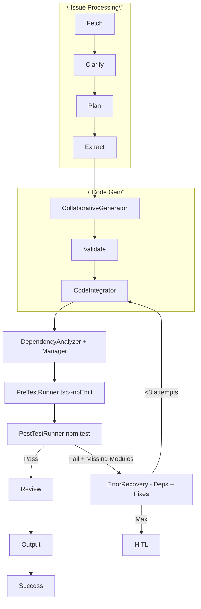

# Agentics Architecture: Automatic Dependency Management

## Current Issues
1. **Missing Dependency Detection in Generated Code**: [`dependency_analyzer_agent.py`](agents/agentics/src/dependency_analyzer_agent.py) scans only existing `src/` files, missing imports in `generated_code` and `generated_tests` (in state).
2. **No Automatic Installation**: Analyzer proposes `state['proposed_js_deps']` but no agent applies them to `package.json` or runs `npm install`.
3. **Test Failures from Missing Deps**: Post-test errors like \"Cannot find module '@uuid/uuid'\" not handled by dependency recovery (e.g., Phase 3 error recovery in [`ARCHITECTURE_REFACTOR.md`](agents/agentics/ARCHITECTURE_REFACTOR.md)).
4. **Workflow Timing**: Analyzer runs too early (after issue processing); should run post-generation/integration.

## Proposed Architecture
Aligns with Phase 4 (npm tools) of [`ARCHITECTURE_REFACTOR.md`](agents/agentics/ARCHITECTURE_REFACTOR.md): Extend tool-integrated agents for dependency lifecycle.

### Core Principles
- **Proactive + Reactive**: Scan generated code pre-tests; recover from test errors.
- **Immutable State**: Extend [`CodeGenerationState`](agents/agentics/src/state.py) with `proposed_js_deps`, `deps_updated`, `missing_modules`.
- **Tool Integration**: Use existing [`npm_search_tool`](agents/agentics/src/tools.py), [`npm_install_tool`](agents/agentics/src/tools.py), [`read_file_tool`](agents/agentics/src/tools.py), [`write_file_tool`](agents/agentics/src/tools.py).
- **Semver Safety**: Use `^latest-minor` via `npm_search_tool`.

### 1. Enhanced Detection: [`dependency_analyzer_agent.py`](agents/agentics/src/dependency_analyzer_agent.py)
Extend to parse `state['generated_code']`, `state['generated_tests']`, + `src/` files.

```python
# In process() (~line 73), after existing src/ scan:
if state.get('generated_code'):
    detected_deps |= self._extract_imports_from_string(state['generated_code'])
if state.get('generated_tests'):
    detected_deps |= self._extract_imports_from_string(state['generated_tests'])

def _extract_imports_from_string(self, content: str) -> set:
    import_patterns = [...]  # Existing patterns
    detected = set()
    for pattern in import_patterns:
        matches = re.findall(pattern, content)
        for match in matches:
            dep = match.split('/')[0] if isinstance(match, str) else match[0]
            if not (dep.startswith('.') or dep == 'obsidian'):
                detected.add(dep)
    return detected

# Refine proposed_js_deps format:
state['proposed_js_deps'] = [
    {'name': dep, 'type': 'dep' if self._is_runtime_dep(dep) else 'devDep', 'version': f\"^{search_result['version']}\"}
    for dep in missing_deps
]
state['missing_modules'] = list(missing_deps)  # For error recovery
```

### 2. Application: New [`DependencyManagerAgent`](agents/agentics/src/dependency_manager_agent.py) (ToolIntegratedAgent)
```python
class DependencyManagerAgent(ToolIntegratedAgent):
    def __init__(self, llm_reasoning):
        super().__init__(llm_reasoning, [read_file_tool, write_file_tool, npm_install_tool, npm_search_tool])

    def process(self, state: CodeGenerationState) -> CodeGenerationState:
        proposed = state.proposed_js_deps or []
        if not proposed:
            state = state.with_deps_updated(True)
            return state

        pkg_path = '/project/package.json'  # PROJECT_ROOT
        pkg_content = self.tool_executor.execute_tool('read_file_tool', {'file_path': pkg_path})
        pkg = json.loads(pkg_content)

        for prop in proposed:
            section = pkg.setdefault(prop['type'], {})
            section[prop['name']] = prop['version']
            self.tool_executor.execute_tool('npm_install_tool', {
                'package_name': prop['name'],
                'is_dev': prop['type'] == 'devDep',
                'cwd': '/project'
            })

        self.tool_executor.execute_tool('write_file_tool', {
            'file_path': pkg_path,
            'content': json.dumps(pkg, indent=2)
        })

        return state.with_deps_updated(True).with_new_deps([p['name'] for p in proposed])
```

### 3. State Extensions [`state.py`](agents/agentics/src/state.py)
```python
@dataclass(frozen=True)
class CodeGenerationState:
    # Existing...
    proposed_js_deps: List[Dict[str, str]] = field(default_factory=list)
    deps_updated: bool = False
    missing_modules: List[str] = field(default_factory=list)
    new_deps: List[str] = field(default_factory=list)

    def with_proposed_deps(self, deps: List[Dict]) -> 'CodeGenerationState':
        return CodeGenerationState(**{k:v for k,v in self.__dict__.items() if k != 'proposed_js_deps'}, proposed_js_deps=deps)

    def with_deps_updated(self, updated: bool) -> 'CodeGenerationState':
        return CodeGenerationState(**{k:v for k,v in self.__dict__.items() if k != 'deps_updated'}, deps_updated=updated)

    def with_missing_modules(self, modules: List[str]) -> 'CodeGenerationState':
        return CodeGenerationState(**{k:v for k,v in self.__dict__.items() if k != 'missing_modules'}, missing_modules=modules)

    def with_new_deps(self, deps: List[str]) -> 'CodeGenerationState':
        return CodeGenerationState(**{k:v for k,v in self.__dict__.items() if k != 'new_deps'}, new_deps=deps)
```
Update adapters.

### 4. Error Recovery Enhancements
- [`post_test_runner_agent.py`](agents/agentics/src/post_test_runner_agent.py): Extend `parse_test_errors` for module errors.
```python
def parse_test_errors(self, log_path: str) -> List[Dict]:
    # Existing TS errors...
    module_pattern = r'Cannot find module \'([^\']+)\' or its corresponding type declarations'
    with open(log_path) as f:
        content = f.read()
    modules = re.findall(module_pattern, content)
    state['missing_modules'] = list(set(modules))  # Dedupe
    return errors + [{'type': 'module', 'module': m} for m in modules]
```

- [`error_recovery_agent.py`](agents/agentics/src/error_recovery_agent.py): Add strategy.
```python
# In _initialize_recovery_strategies():
\"POST_TEST_RUNNER\": {
    # Existing...
    \"fallback_strategy\": self._test_failure_recovery_or_deps,
}

def _test_failure_recovery_or_deps(self, state, error_context, original_error):
    missing = state.get('missing_modules', [])
    if missing:
        # Trigger DependencyAnalyzer + DependencyManager
        state = DependencyAnalyzerAgent().process(state)
        state = DependencyManagerAgent(self.llm_reasoning).process(state)
        state = state.with_recovery(...)  # Existing
    else:
        # Existing test fixes
    return {'success': True}
```

### 5. Workflow Integration [`composable_workflows.py`](agents/agentics/src/composable_workflows.py)
- Invoke analyzer post-code_gen/integration, pre-pre_test.
```python
# In _create_full_workflow():
graph.add_node(\"dependency_management\", dependency_management_node)  # Analyzer + Manager chain

# Edges:
graph.add_edge(\"code_generation\", \"code_integrator\")
graph.add_edge(\"code_integrator\", \"dependency_management\")
graph.add_edge(\"dependency_management\", \"pre_test_runner\")

def dependency_management_node(state):
    cg_state = StateToCodeGenerationStateAdapter().invoke(state)
    cg_state = composer.agents[\"dependency_analyzer\"].invoke(cg_state)
    if cg_state.proposed_js_deps:
        cg_state = DependencyManagerAgent(llm_reasoning).invoke(cg_state)
    result_state = CodeGenerationStateToStateAdapter().invoke(cg_state)
    return result_state
```
- Register new agents in `_register_agents()`.

### Updated Workflow Diagram


## Implementation Plan
#### Phase 1: State + Detection
1. Extend [`state.py`](agents/agentics/src/state.py) with fields + methods.
2. Enhance [`dependency_analyzer_agent.py`](agents/agentics/src/dependency_analyzer_agent.py) for generated code scanning.

#### Phase 2: Manager + Recovery
1. Create [`dependency_manager_agent.py`](agents/agentics/src/dependency_manager_agent.py).
2. Extend [`post_test_runner_agent.py`](agents/agentics/src/post_test_runner_agent.py) + [`error_recovery_agent.py`](agents/agentics/src/error_recovery_agent.py).

#### Phase 3: Workflow + Tests
1. Integrate into [`composable_workflows.py`](agents/agentics/src/composable_workflows.py).
2. Add unit tests: `tests/unit/test_dependency_analyzer_agent_unit.py`, `tests/integration/test_npm_tools_integration.py`.
3. Integration: Simulate generated code with `@uuid/uuid`, verify install + state.

## Risks & Mitigations
- **NPM Version Resolution**: Use `npm_search_tool` for `^latest`; fallback to `latest` if fails.
- **Peer Deps Conflicts**: Manager LLM-prompt to resolve (add peer check via `npm ls`).
- **Lockfile Drift**: Run `npm install` post-write; ignore lockfile changes in tests.
- **Non-NPM Deps**: Filter regex to npm-style (`@scope/name`).
- **Performance**: Cache `npm_search` (existing LRU); limit to top 10 missing.

Plan ready for Code mode implementation.
