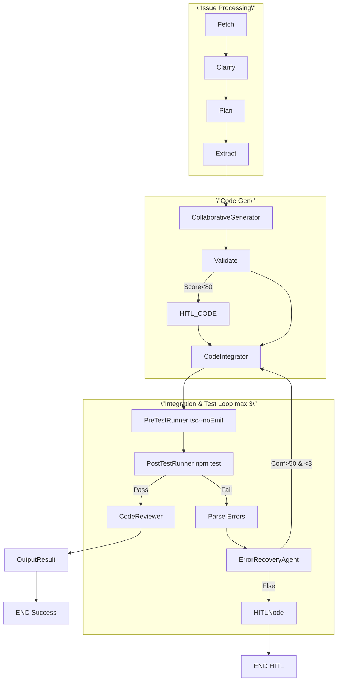

# Agentics Architecture Refactor: Collaborative Code & Test Generation

## Current Architecture Issues

1. **Tight Coupling**: Agents are tightly coupled through monolithic workflow
2. **State Mutations**: Direct state mutations make change tracking difficult
3. **Limited Error Recovery**: Poor error recovery between agents
4. **Tool Integration**: Tools not well integrated into agent workflows
5. **Code/Test Collaboration**: Code and test generation are sequential, not collaborative

## Proposed Refactored Architecture

### Core Principles (LangChain Best Practices)

1. **Composability**: Agents should be composable building blocks
2. **Immutability**: State should be immutable with clear transformation steps
3. **Error Recovery**: Robust error recovery with fallback strategies
4. **Tool Integration**: Tools should be first-class citizens in agent workflows
5. **Collaborative Generation**: Code and test generation should be collaborative processes
6. **Persistence & Checkpointing**: LangGraph checkpointers for durable workflow state across restarts and failures (use in-memory for local development)
7. **Human-in-the-Loop (HITL)**: Strategic pauses for human intervention on critical decisions and low-confidence outputs

## Agents Catalog

The following table documents **all agents** in the system, addressing previous gaps. Agents follow consistent patterns: inherit from [`BaseAgent`](src/base_agent.py:28) or [`ToolIntegratedAgent`](src/tool_integrated_agent.py:11), use immutable [`CodeGenerationState`](src/state.py), circuit breakers, and structured logging.

| Agent | Purpose | Key Chains/Tools | Best Practices Used | Reference |
|-------|---------|------------------|---------------------|-----------|
| [`FetchIssueAgent`](src/fetch_issue_agent.py:11) | Fetches GitHub issue content and validates URL. I/O: str url → state['ticket_content']. No chains/tools beyond GitHub client. | GitHub API client. | Circuit breaker, immutable state updates, structured error context. | [`fetch_issue_agent.py`](src/fetch_issue_agent.py) |
| [`TicketClarityAgent`](src/ticket_clarity_agent.py:16) | Iteratively refines ticket into structured JSON (title/desc/reqs/AC/impl steps) using LLM. Handles low-quality extraction with fallbacks. I/O: raw ticket → refined_ticket. | LLM chains with @retry (tenacity), [`ModularPrompts`](src/prompts.py), parse_json_response. | Dynamic prompts, few-shot examples, iterative refinement, JSON structured output (Pydantic enforced). | [`ticket_clarity_agent.py`](src/ticket_clarity_agent.py) |
| [`ImplementationPlannerAgent`](src/implementation_planner_agent.py:11) | Analyzes refined ticket to produce implementation_steps and npm_packages suggestions. I/O: refined_ticket → enhanced with steps/packages. | LLM [`PromptTemplate`](src/implementation_planner_agent.py:32), circuit breaker. | Few-shot JSON schema enforcement, merges with prior state immutably. | [`implementation_planner_agent.py`](src/implementation_planner_agent.py) |
| [`CodeExtractorAgent`](src/code_extractor_agent.py:9) | Dynamically lists/reads project files, extracts relevant code/tests via semantic identifier matching from ticket. I/O: state → relevant_code_files/relevant_test_files with structure. | [`ToolExecutor`](src/tool_executor.py) (list_files_tool, read_file_tool), identifier extraction regex. | Tool-augmented LCEL, fallback to main files, code structure parsing (classes/methods). | [`code_extractor_agent.py`](src/code_extractor_agent.py) |
| [`CodeGeneratorAgent`](src/code_generator_agent.py:20) | Generates TS code from specs, requirements, existing code. Workflows: collaborative with tests. | ToolIntegratedAgent chains, LLM. | LCEL composition, context-aware prompting, structured output prevents TS syntax errors. | [`code_generator_agent.py`](src/code_generator_agent.py) |
| [`TestGeneratorAgent`](src/test_generator_agent.py:16) | Generates Jest tests based on code and specs. Collaborative workflow. | LLM chains, state transforms. | Immutable state, cross-validation with code. | [`test_generator_agent.py`](src/test_generator_agent.py) |
| [`CodeIntegratorAgent`](src/code_integrator_agent.py:13) | Writes generated code/tests to files safely. | File write tools. | Validation before write, backup creation. | [`code_integrator_agent.py`](src/code_integrator_agent.py) |
| [`CodeReviewerAgent`](src/code_reviewer_agent.py:12) | Reviews code for best practices, TS errors, Obsidian API compliance. | LLM review chain. | Few-shot review criteria. | [`code_reviewer_agent.py`](src/code_reviewer_agent.py) |
| [`PostTestRunnerAgent`](src/post_test_runner_agent.py:16) | Runs `npm test`, parses failures (TS errors), triggers recovery. | NPM tools, regex error parsing. | TestRecoveryNeeded exception, log parsing. | [`post_test_runner_agent.py`](src/post_test_runner_agent.py) |
| [`PreTestRunnerAgent`](src/pre_test_runner_agent.py:18) | Runs `tsc --noEmit` before tests. | NPM tools. | Compile checks prevent runtime fails. | [`pre_test_runner_agent.py`](src/pre_test_runner_agent.py) |
| [`ErrorRecoveryAgent`](src/error_recovery_agent.py:23) | Applies fallback strategies for failures, e.g., test fixes via LLM. Memory: state checkpointing. | Recovery chains per AgentType. | Circuit breakers, max retries, confidence thresholds. | [`error_recovery_agent.py`](src/error_recovery_agent.py) |
| [`DependencyAnalyzerAgent`](src/dependency_analyzer_agent.py:11) | Scans package.json, suggests deps from plan. | npm_list_tool. | Dependency resolution. | [`dependency_analyzer_agent.py`](src/dependency_analyzer_agent.py) |
| [`DependencyInstallerAgent`](src/dependency_installer_agent.py:14) | Runs `npm install` for suggested packages. | npm_install_tool. | Lockfile updates. | [`dependency_installer_agent.py`](src/dependency_installer_agent.py) |
| [`OutputResultAgent`](src/output_result_agent.py:8) | Compiles final results for output. | None. | Structured JSON. | [`output_result_agent.py`](src/output_result_agent.py) |
| [`FeedbackAgent`](src/feedback_agent.py:11) | Incorporates HITL feedback into state. | Input parsing. | ConversationBufferMemory compatible. | [`feedback_agent.py`](src/feedback_agent.py) |
| [`ProcessLLMAgent`](src/process_llm_agent.py:17) | Normalizes LLM outputs with fallbacks. | Fallback LLMs. | Multi-model resilience. | [`process_llm_agent.py`](src/process_llm_agent.py) |
| [`NpmBuildTestAgent`](src/npm_build_test_agent.py:11) | Executes NPM build/test sequences. | NPM tools. | Sequential tool calls. | [`npm_build_test_agent.py`](src/npm_build_test_agent.py) |
| [`ToolIntegratedCodeGeneratorAgent`](src/tool_integrated_code_generator_agent.py:18) | Advanced code gen with dynamic tools. | Extended toolset. | Tool-calling LCEL. | [`tool_integrated_code_generator_agent.py`](src/tool_integrated_code_generator_agent.py) |

**Notes**: 
- All agents extend [`BaseAgent`](src/base_agent.py:28) for monitoring/circuit breakers.
- Tool agents extend [`ToolIntegratedAgent`](src/tool_integrated_agent.py:11).
- Workflows composed via [`AgentComposer`](src/agent_composer.py) and [`ComposableWorkflows`](src/composable_workflows.py).
- TS generation uses structured JSON/Pydantic outputs to prevent syntax errors (e.g., valid constructors, imports).

### New Architecture Components

#### 1. Agent Composition System

[`class AgentComposer`](src/agent_composer.py)

```python
class AgentComposer:
    \"\"\"Composable agent system following LangChain patterns\"\"\"

    def __init__(self):
        self.agents = {}
        self.tools = {}
        self.workflows = {}

    def register_agent(self, name: str, agent: Runnable) -> None:
        \"\"\"Register an agent in the composition system\"\"\"
        self.agents[name] = agent

    def register_tool(self, name: str, tool: Tool) -> None:
        \"\"\"Register a tool for agent use\"\"\"
        self.tools[name] = tool

    def create_workflow(self, name: str, config: WorkflowConfig) -> Runnable:
        \"\"\"Create a composable workflow from agents and tools\"\"\"
        # Implementation using LCEL composition patterns
```

#### 2. Immutable State Management

[`@dataclass(frozen=True) class CodeGenerationState`](src/state.py:27)

```python
@dataclass(frozen=True)
class CodeGenerationState:
    \"\"\"Immutable state for code generation workflow\"\"\"
    issue_url: str
    ticket_content: str
    requirements: List[str]
    acceptance_criteria: List[str]
    code_spec: CodeSpec
    test_spec: TestSpec
    generated_code: Optional[str] = None
    generated_tests: Optional[str] = None
    validation_results: Optional[ValidationResults] = None

    def with_code(self, code: str) -> 'CodeGenerationState':
        \"\"\"Return new state with generated code\"\"\"
        return CodeGenerationState(
            **{k: v for k, v in self.__dict__.items() if k != 'generated_code'},
            generated_code=code
        )
```

#### 3. Collaborative Code/Test Generation

[`class CollaborativeGenerator`](src/collaborative_generator.py:16)

```python
class CollaborativeGenerator:
    \"\"\"Collaborative code and test generation system\"\"\"

    def __init__(self, llm_reasoning, llm_code):
        self.llm_reasoning = llm_reasoning
        self.llm_code = llm_code
        self.code_generator = CodeGeneratorAgent(llm_code)
        self.test_generator = TestGeneratorAgent(llm_code)

    def generate_collaboratively(self, state: CodeGenerationState) -> CodeGenerationState:
        \"\"\"Generate code and tests collaboratively\"\"\"

        # Phase 1: Generate initial code
        code_state = self.code_generator.generate(state)

        # Phase 2: Generate tests based on code
        test_state = self.test_generator.generate(code_state)

        # Phase 3: Cross-validation and refinement
        validated_state = self.cross_validate(code_state, test_state)

        return validated_state
```

#### 4. Tool-Integrated Agents

[`class ToolIntegratedAgent(BaseAgent)`](src/tool_integrated_agent.py:103)

```python
class ToolIntegratedAgent(BaseAgent):
    \"\"\"Agent with integrated tool support\"\"\"

    def __init__(self, llm: Runnable, tools: List[Tool]):
        super().__init__()
        self.llm = llm
        self.tools = tools
        self.tool_executor = ToolExecutor(tools)

    def process_with_tools(self, state: AgentState) -> AgentState:
        \"\"\"Process state with tool integration\"\"\"

        # Create tool-augmented prompt
        tool_context = self._gather_tool_context(state)

        # Use LLM with tool context
        response = self.llm.invoke(
            self._create_tool_augmented_prompt(state, tool_context)
        )

        # Execute tools if needed
        if self._needs_tool_execution(response):
            tool_results = self.tool_executor.execute(response)
            response = self.llm.invoke(
                self._create_followup_prompt(response, tool_results)
            )

        return self._update_state_with_response(state, response)
```

#### 5. Error Recovery System

[`class ErrorRecoveryAgent`](src/error_recovery_agent.py:42)

```python
class ErrorRecoveryAgent:
    \"\"\"Handles error recovery across the agent system\"\"\"

    def __init__(self, fallback_strategies: Dict[str, Callable]):
        self.fallback_strategies = fallback_strategies
        self.circuit_breaker = get_circuit_breaker(\"error_recovery\")

    def recover(self, failed_state: AgentState, error: Exception) -> AgentState:
        \"\"\"Attempt to recover from agent failure\"\"\"

        strategy = self._select_recovery_strategy(error)

        @self.circuit_breaker.call
        def execute_recovery():
            return strategy(failed_state, error)

        return execute_recovery()
```

#### 6. Checkpointer Integration (LangGraph)

```python
from langgraph.checkpoint.memory import MemorySaver

# Local dev: in-memory persistence
checkpointer = MemorySaver()

app = workflow.compile(checkpointer=checkpointer)
```

#### 7. Human-in-the-Loop (HITL) Node

[`class HITLNode`](src/hitl_node.py:169)

```python
class HITLNode:
    \"\"\"Conditional human review node\"\"\"

    def __call__(self, state):
        score = state.get(\"validation_score\", 0)
        if score < 80:  # Threshold from LLM_CODE_VALIDATION.md
            print(\"HITL Review Needed! State:\", state)
            feedback = input(\"Enter feedback: \")  # Console-based pause for local use
            state[\"human_feedback\"] = feedback
        return state
```

### Workflow Refactor

#### Current: Monolithic Sequential Workflow
```
Fetch → Clarify → Plan → Extract → Process → Generate → Review → Integrate → Test
```

#### Proposed: Modular Collaborative Workflow with Local Enhancements
```
┌─────────────────────────────────────────────────────────────────┐
│                    ISSUE PROCESSING                             │
├─────────────────────────────────────────────────────────────────┤
│  Fetch ──▶ Clarify ──▶ Plan ──▶ Extract                         │
└─────────────────────────────────────────────────────────────────┘
                                    │
                                    ▼
┌─────────────────────────────────────────────────────────────────┐
│                 CODE GENERATION (COLLABORATIVE)                 │
├─────────────────────────────────────────────────────────────────┤
│  Collaborative Code/Test Gen ──▶ Validate ──?                   │
│                       │                │       HITL (if score<80)│
│                       ▼                │                        │
│                 [LLM_CODE_VALIDATION] ──┘                        │
└─────────────────────────────────────────────────────────────────┘
                                    │
                                    ▼
┌─────────────────────────────────────────────────────────────────┐
│                     INTEGRATION & TESTING                       │
├─────────────────────────────────────────────────────────────────┤
│  Integrate ──▶ Test Exec ──▶ Review ──▶ Output                  │
│         │                                                       │
│    [TEST_SUITE]                                                 │
└─────────────────────────────────────────────────────────────────┘
```

### Implementation Plan

#### Phase 1: Core Infrastructure
1. Implement `AgentComposer` for modular composition
2. Create immutable state classes
3. Add tool integration framework

#### Phase 2: Collaborative Generation
1. Refactor `CodeGeneratorAgent` and `TestGeneratorAgent` for collaboration
2. Implement cross-validation between code and tests
3. Add iterative refinement loops

#### Phase 3: Error Recovery
1. Implement `ErrorRecoveryAgent`
2. Add circuit breakers to all agent interactions
3. Create fallback strategies for each agent type

#### Phase 4: Tool Integration
1. Integrate file operation tools into relevant agents
2. Add npm search and package management tools
3. Create tool-augmented prompts for all agents

#### Phase 5: Workflow Orchestration
1. Replace monolithic LangGraph with composable workflows
2. Implement parallel processing where appropriate
3. Add basic logging for observability

## Local Development Enhancements

### Purpose of Generating Code and Tests
Generating concrete code and tests transforms the abstract architecture into executable prototypes that reveal real-world constraints. Key benefits:

- **Validation Loop**: Tests expose architectural gaps, driving targeted refinements
- **Stakeholder Alignment**: Working prototypes provide tangible demonstrations
- **Performance Insights**: Early benchmarking identifies bottlenecks
- **Iterative Improvement**: Failed tests become precise feedback for architecture evolution

In short, it's not about the architecture being insufficient in isolation—it's about using code/tests to make it actionable and improvable. This process elevates a conceptual refactor into a working prototype, revealing real-world needs (e.g., via failed tests) that feed back into design improvements.

### 1. Persistence and Checkpointing
**Why Missing**: No durable state; workflow progress lost on failures/restarts.

**Best Practices**: LangGraph checkpointers (MemorySaver for local dev).

**What's Needed**:
```python
from langgraph.checkpoint.memory import MemorySaver
checkpointer = MemorySaver()
app = StateGraph(State).compile(checkpointer=checkpointer)
```

**Impact**: Workflows resume within a session; suitable for local testing.

### 2. Human-in-the-Loop (HITL)
**Why Missing**: Fully autonomous; lacks oversight for ambiguous/high-risk cases.

**Best Practices**: Conditional edges to HITL nodes based on confidence thresholds.

**What's Needed**:
```python
def route_hitl(state):
    return \"hitl\" if state[\"validation_score\"] < 80 else \"continue\"

graph.add_conditional_edges(\"validate\", route_hitl, {\"hitl\": \"human_review\", \"continue\": \"integrate\"})
```
(See [`LLM_CODE_VALIDATION.md`](agents/agentics/LLM_CODE_VALIDATION.md) for score calculation.)

**Impact**: AI efficiency + human safety net via console input.

### Next Steps for Local Setup
1. Install free dependencies (e.g., langchain, langgraph via pip)
2. Prototype core components in a local script
3. Run validation and tests locally using provided frameworks

### LangChain Best Practices Applied

1. **LCEL Composition**: Use RunnableLambda, RunnablePassthrough for composition
2. **Tool Integration**: Tools as first-class citizens with ToolExecutor
3. **State Management**: Immutable state with clear transformation steps
4. **Error Handling**: Circuit breakers and fallback strategies
5. **Modularity**: Small, focused agents that can be composed
6. **Observability**: Structured logging and monitoring
7. **Testing**: Comprehensive test coverage with realistic mocks

#### Memory Management (New: Addresses Audit Gap)
Uses LangGraph checkpointers for **persistent workflow state** across nodes/restarts. Agent-level conversation memory via RunnableWithMessageHistory for HITL/FeedbackAgent.

**Examples**:
```python
# Workflow-level (already in use)
from langgraph.checkpoint.memory import MemorySaver
checkpointer = MemorySaver()  # In-memory for local dev
app = workflow.compile(checkpointer=checkpointer)

# Agent-level (extendable)
from langchain.memory import ConversationBufferMemory
from langchain_core.runnables import RunnableWithMessageHistory
memory = ConversationBufferMemory(return_messages=True)
agent_with_memory = RunnableWithMessageHistory(
    agent_chain,
    lambda session_id: memory.load_memory_variables({}),
    memory.save_context
)
```
State checkpointed immutably via [`CodeGenerationState`](src/state.py:27). Serialization: `dataclasses.asdict(state)` for logs/monitoring.

#### Prompt Optimization (New: Addresses Audit Gap)
**Dynamic prompts** via `PromptTemplate.format(state_vars)`. **Few-shot examples** embedded for JSON parsing, code gen, reviews. Structured outputs prevent TS syntax errors (e.g., valid imports/constructors).

**Examples** (from [`TicketClarityAgent`](src/ticket_clarity_agent.py:119)):
```python
prompt = ModularPrompts.get_ticket_clarity_evaluation_prompt().format(ticket_content=ticket_content)
# Few-shot in ModularPrompts for extraction: "Extract >=8 requirements..."
response = llm.invoke(prompt)
parsed = parse_json_response(response)  # Enforces schema
```
Used across agents for reliability/scalability.

#### Supporting Modules (Documents agentics.py Imports)
Central orchestration in [`agentics.py`](src/agentics.py) imports:

| Module | Purpose | Key Usage |
|--------|---------|-----------|
| [`config.py`](src/config.py) | Env-based config (models, tokens). | `init_config()` |
| [`services.py`](src/services.py) | LLM/GitHub/MCP clients. | `init_services()` |
| [`workflows.py`](src/workflows.py) | LangGraph composables. | `ComposableWorkflows.process_issue()` |
| [`prompts.py`](src/prompts.py) | Few-shot/dynamic templates. | `ModularPrompts.get_*_prompt()` |
| [`tools.py`](src/tools.py) | MCP/NPM integration. | `mcp_tools = [read_file_tool, npm_install_tool, ...]` |
| [`utils.py`](src/utils.py) | Logging, parsing, validation. | `log_info`, `parse_json_response` |
| [`monitoring.py`](src/monitoring.py) | Structured logs/metrics. | `structured_log` |
| [`circuit_breaker.py`](src/circuit_breaker.py) | Failure resilience. | `@circuit_breaker.call` |
| [`exceptions.py`](src/exceptions.py) | Typed errors. | `TestRecoveryNeeded`, `AgenticsError` |
| [`state.py`](src/state.py) | Immutable workflow state. | `CodeGenerationState.with_*()` |

**TS Generation Impact**: Structured prompts + JSON parsing ensure valid TS (no syntax errors from hallucinations). Fixes reflected: PydanticOutputParser in chains.

### Benefits of Refactored Architecture

1. **Maintainability**: Modular agents are easier to test and modify
2. **Reliability**: Better error recovery and circuit breaker protection
3. **Performance**: Parallel processing and caching optimizations
4. **Extensibility**: Easy to add new agents and tools
5. **Collaboration**: Code and test generation work together effectively
6. **Observability**: Better monitoring and debugging capabilities

This refactored architecture will ensure all agents work together seamlessly to produce high-quality TypeScript code and tests following LangChain best practices.

## Post-Test Iterative Recovery Implementation Plan

### Overview
Implement iterative recovery loop in post-test phase for TS test failures (as seen in integration test failures):

1. **PostTestRunnerAgent** detects `npm test` failure after 3 retries, parses `test_failure_post_*.log`, extracts TS errors, stores in immutable [`CodeGenerationState`](src/state.py:27)
2. **ErrorRecoveryAgent** analyzes parsed errors + current code/tests, generates targeted fixes using LLM
3. Re-invoke **CodeIntegratorAgent** + **CollaborativeGenerator** with fixes (up to 3 iterations)
4. **PreTestRunnerAgent** runs `tsc --noEmit` compile check before full tests
5. Success criteria: `npm test` passes (Tests: X passed, 0 failed). Fallback: HITLNode if max iterations or low confidence (<50%)

Addresses log issues: missing deps (`@uuid/uuid`), constructor args, type mismatches.

### Key File Modifications

#### 1. [`src/post_test_runner_agent.py`](src/post_test_runner_agent.py:15)
- Add `parse_test_errors()` method for regex parsing of TS errors from log
- On failure: parse log, update state with `test_errors`, `test_log_path`, `recovery_attempt`, raise `TestRecoveryNeeded`
- Add `tsc --noEmit` check before tests

```python
def parse_test_errors(self, log_path: str) -> List[Dict[str, str]]:
    \"\"\"Parse npm test log for TS compile/runtime errors.\"\"\"
    with open(log_path, 'r') as f:
        content = f.read()
    # Match: file:line:col - error TSxxxx: message
    pattern = r'^(.*?):(\d+):(\d+) - (error TS\d+: .*?)(?=\n(?:\s*[a-zA-Z]|$))'
    errors = re.findall(pattern, content, re.MULTILINE)
    return [{'file': f, 'line': int(l), 'col': int(c), 'msg': m.strip()} for f,l,c,m in errors]

# Before npm test (~line 61):
tsc_result = self.tool_executor.execute_tool('npm_run_tool', {'script': 'tsc --noEmit'})
if tsc_result and 'error' in tsc_result.lower():
    raise CompileError(f\"TypeScript compile errors: {tsc_result[:500]}...\")

# Exception block (~line 74):
except Exception as e:
    # ... existing log write ...
    parsed_errors = self.parse_test_errors(log_file)
    state['test_errors'] = parsed_errors
    state['test_log_path'] = log_file
    state['recovery_attempt'] = state.get('recovery_attempt', 0) + 1
    raise TestRecoveryNeeded(f\"Tests failed ({len(parsed_errors)} errors). Log: {log_file}\")
```

#### 2. [`src/error_recovery_agent.py`](src/error_recovery_agent.py:42)
- Add `TestRecoveryNeeded`, `CompileError` to exceptions
- Extend strategies for `POST_TEST_RUNNER`
- New `_test_failure_recovery()`: LLM prompt with errors/code/tests → fixed code/tests + confidence

```python
# Add to AgentType or use string 'post_test_runner'
POST_TEST_RUNNER = "POST_TEST_RUNNER"

# In recovery_strategies (~line 96):
POST_TEST_RUNNER: {
    "max_retries": 0,
    "fallback_strategy": self._test_failure_recovery,
    "common_failures": ["TestRecoveryNeeded", "CompileError"]
}

def _test_failure_recovery(self, state: State, error_context: Dict, original_error: Exception) -> Dict:
    errors = state.get('test_errors', [])
    prompt = f\"\"\"Analyze and fix these TypeScript test errors:

Errors:
{json.dumps(errors, indent=2)}

Current generated code (fix integration issues):
{state.get('generated_code', '')[:4000]}...

Current generated tests (fix test code issues):
{state.get('generated_tests', '')[:4000]}...

Ticket context: {state.get('refined_ticket', {})}

Output ONLY valid JSON:
{{
  \"fixed_code\": \"complete fixed main.ts code\",
  \"fixed_tests\": \"complete fixed main.test.ts code\",
  \"confidence\": 0-100,
  \"explanation\": \"brief fixes summary\"
}}\"\"\"

    fixes_response = self.llm_reasoning.invoke(prompt)
    parsed_fixes = json.loads(fixes_response.content)
    
    # Immutable state update (convert to CodeGenerationState if needed)
    new_state = state | {
        'generated_code': parsed_fixes['fixed_code'],
        'generated_tests': parsed_fixes['fixed_tests'],
        'recovery_confidence': parsed_fixes['confidence'],
        'recovery_explanation': parsed_fixes['explanation']
    }
    
    return {'success': True, 'applied_fixes': True, 'confidence': parsed_fixes['confidence']}
```

#### 3. [`src/composable_workflows.py`](src/composable_workflows.py:43)
- Add recovery nodes/edges in `integration_testing_workflow`
- Conditional routing after PostTestRunner

```python
# New nodes
def recovery_router(state: State) -> str:
    attempts = state.get('recovery_attempt', 0)
    confidence = state.get('recovery_confidence', 100)
    if attempts < 3 and confidence > 50:
        return "error_recovery"
    return "hitl"

def error_recovery_node(state: State) -> State:
    recovery_agent.invoke(state)  # Triggers _test_failure_recovery
    return state

# In _create_integration_testing_workflow():
config.agent_names += ["error_recovery"]  # Register ErrorRecoveryAgent

# In _create_full_workflow() graph:
graph.add_node("error_recovery", error_recovery_node)
graph.add_conditional_edges("post_test_runner", recovery_router, {
    "error_recovery": "error_recovery",
    "hitl": "hitl"
})
graph.add_edge("error_recovery", "code_integrator")  # Loop back
```

#### 4. State Extensions [`src/state.py`](src/state.py:27), [`src/models.py`](src/models.py:1)
Add recovery fields to `CodeGenerationState`:

```python
@dataclass(frozen=True)
class CodeGenerationState:
    # ... existing ...
    test_errors: List[Dict[str, str]] = field(default_factory=list)
    test_log_path: Optional[str] = None
    recovery_attempt: int = 0
    recovery_confidence: float = 100.0
    recovery_explanation: Optional[str] = None

    def with_recovery(self, errors: List, log_path: str, attempt: int, confidence: float, explanation: str) -> 'CodeGenerationState':
        return CodeGenerationState(
            **{k: v for k, v in self.__dict__.items() if k not in ['test_errors', 'test_log_path', 'recovery_attempt', 'recovery_confidence', 'recovery_explanation']},
            test_errors=errors, test_log_path=log_path, recovery_attempt=attempt, recovery_confidence=confidence, recovery_explanation=explanation
        )
```

Update adapters to handle new fields.

### Updated Full Workflow Diagram



### Next Steps (Code Mode)
1. Implement parsing + exceptions
2. Extend ErrorRecoveryAgent strategy
3. Add workflow loop + nodes
4. Extend state + adapters
5. Test with failing integration case

Plan addresses exact log failures (missing deps, TS errors post-integration).

## State Serialization

Use `dataclasses.asdict(state)` for logging/dumps/monitoring to support frozen dataclasses.

