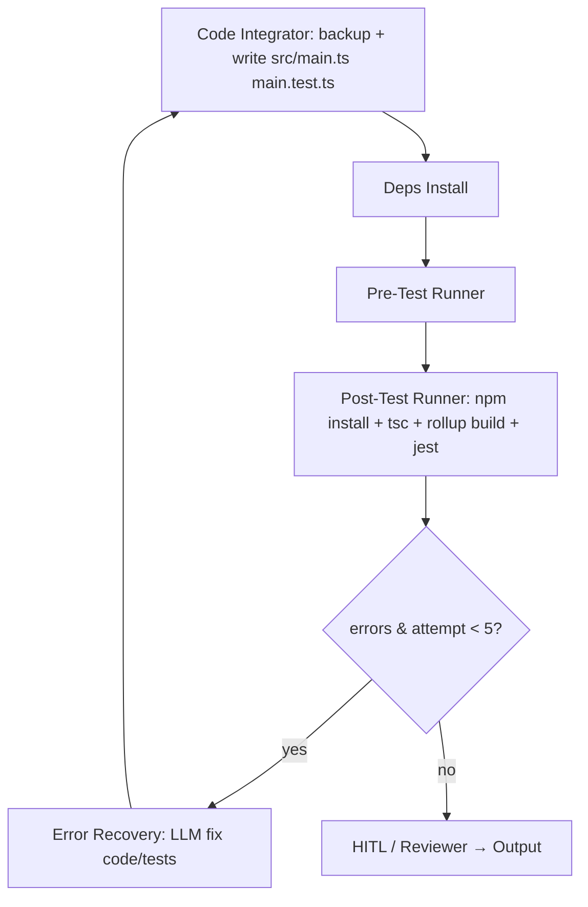

# TS Iterative Fix Plan for Obsidian Plugin

## Overview

Current system partially supports TS error fixing:
- [`npm_build_test_agent.py`](agents/agentics/src/npm_build_test_agent.py) runs build/test on generated code strings, proposes fixes (one-shot).
- Integration graph ([`composable_workflows.py`](agents/agentics/src/composable_workflows.py:L157)) loops: integrator → deps → pre-test → post-test → recovery → integrator (max 3 attempts).
- [`post_test_runner_agent.py`](agents/agentics/src/post_test_runner_agent.py) runs tsc + jest, parses TS errors, raises `TestRecoveryNeeded`.
- [`error_recovery_agent.py`](agents/agentics/src/error_recovery_agent.py) fixes code/tests via LLM.
- No rollup parsing, no backups, limited loop (3→5), no build_errors state.

**Goals**:
- Full loop until clean rollup build + jest OR max_attempts=5.
- Backups before integrator writes `src/main.ts`, `src/__tests__/main.test.ts`.
- Enhanced rollup/TS/Jest parsing.
- TS-specific prompts (Obsidian mocks).
- State: `build_errors`, `max_build_attempts=5`, `current_build_attempt`.
- Optional git commit post-backup.

**Key Changes Summary**:
- Extend state, prompts.
- Add backups + git option in integrator.
- Enhance post_test_runner parsing + add rollup build.
- Update recovery_router max attempts.
- Integrate npm_build_test logic into post_test for full loop.

## Per-File Changes

### 1. [`agents/agentics/src/state.py`](agents/agentics/src/state.py) ~L55 (after `test_errors`)
Add to `CodeGenerationState`:
```
build_errors: List[Dict[str, str]] = field(default_factory=list)
max_build_attempts: int = 5
current_build_attempt: int = 0
```
Update `with_recovery` to include `build_errors`.

### 2. [`agents/agentics/src/prompts.py`](agents/agentics/src/prompts.py) ~L282 (after `get_npm_build_test_fix_prompt`)
Add:
```
@staticmethod
def get_ts_build_fix_prompt():
    return \"\"\"
You are expert in Obsidian TS plugins (rollup/Jest). Fix TS compile (rollup/tsc), Jest errors in `src/main.ts`/`src/__tests__/main.test.ts`.

Obsidian mocks: use `src/__mocks__/obsidian.ts` patterns (mockEditor.replaceSelection, mockApp.workspace.getActiveViewOfType etc.).

Errors: {errors}

Code: {generated_code}

Tests: {generated_tests}

Output JSON: {{\"code_fixes\": \"updated main.ts snippet\", \"test_fixes\": \"updated main.test.ts snippet\", \"explanation\": \"fixes\"}}
\"\"\".format(...)
```
Update `npm_build_test_agent._propose_fixes` L97: use `get_ts_build_fix_prompt()`.

### 3. [`agents/agentics/src/code_integrator_agent.py`](agents/agentics/src/code_integrator_agent.py) ~L20 (init) + ~L89 (process, before update_file/create_file)
Import:
```
import shutil
from datetime import datetime
```
Add method:
```
def backup_file(self, file_path: str, attempt: int):
    if not os.path.exists(file_path):
        return
    timestamp = datetime.now().strftime(\"%Y%m%d_%H%M%S\")
    backup_dir = os.path.join(self.project_root, 'src', 'backups')
    os.makedirs(backup_dir, exist_ok=True)
    backup_name = f\"{os.path.basename(file_path)}.{timestamp}.attempt{attempt}.bak\"
    backup_path = os.path.join(backup_dir, backup_name)
    shutil.copy2(file_path, backup_path)
    self.monitor.info(f\"Backed up {{file_path}} → {{backup_path}}\")
```
In `process` ~L123/135 (before `self.update_file`):
```
self.backup_file(abs_file_path, state.get('current_build_attempt', 0))
# Optional git:
# self.tool_executor.execute_tool('execute_command_tool', {'command': f'cd {self.project_root} && git add . && git commit -m \"Backup before attempt {{state.get(\"current_build_attempt\", 0)}}\"'})
```
Add `execute_command_tool` to `__init__` tools.

For new files: skip backup.

### 4. [`agents/agentics/src/post_test_runner_agent.py`](agents/agentics/src/post_test_runner_agent.py) ~L32 (rename parse_test_errors → parse_errors)
Rename `parse_test_errors` → `parse_errors`. Enhance ~L35:
```
# TS/tsc
ts_pattern = r'^(.*?):(\\d+):(\\d+) - (error TS\\d+: .*?)(?=\\n(?:\\s*[a-zA-Z]|$))'
# Rollup
rollup_pattern = r'[!>]\\s*(src[/\\\\](.*?)\\.ts):(\\d+):(\\d+)\\s*(error TS\\d+:\\s*(.*?))'
# Jest FAIL (add)
jest_fail_pattern = r'FAIL\\s+(.+?)\\n(.*?)(?=\\n\\nFAIL|\\n\\nTest Suites|\\Z)'
errors = []
for pat, typ in [(ts_pattern, 'ts'), (rollup_pattern, 'rollup'), (jest_fail_pattern, 'jest')]:
    for match in re.finditer(pat, content, re.MULTILINE | re.DOTALL):
        # parse groups to dict {'type': typ, 'file', 'line', 'col', 'msg'}
```
~L78: after typecheck, add rollup:
```
rollup_result = self.tool_executor.execute_tool('npm_run_tool', {'script': 'build', 'cwd': self.project_root})
if 'error' in rollup_result.lower():
    # parse rollup_result, log, raise with build_errors
```
~L88/121: set `state['build_errors'] = parsed_errors` (unify test/build), `state['current_build_attempt'] +=1`
Update `recovery_attempt` → `current_build_attempt`, check < state.get('max_build_attempts',5)

### 5. [`agents/agentics/src/composable_workflows.py`](agents/agentics/src/composable_workflows.py) ~L182 (recovery_router)
```
def recovery_router(state: CodeGenerationState) -> str:
    attempt = state.current_build_attempt
    max_attempts = getattr(state, 'max_build_attempts', 5)
    confidence = getattr(state, 'recovery_confidence', 0.0)
    errors = len(state.build_errors or []) + len(state.test_errors or [])
    return \"error_recovery\" if attempt < max_attempts and confidence > 50 and errors > 0 else \"hitl\"
```
~L210: edge from error_recovery → code_integrator.

### 6. [`agents/agentics/src/npm_build_test_agent.py`](agents/agentics/src/npm_build_test_agent.py) ~L55 (_parse_errors)
Enhance regex like post_test (rollup/TS/Jest).
~L21 command: ensure cd to repo root.
Update state['build_errors'] = errors (align).

### 7. [`agents/agentics/src/error_recovery_agent.py`](agents/agentics/src/error_recovery_agent.py) ~L35 (prompt)
Update prompt to use `get_ts_build_fix_prompt()`, handle rollup/Obsidian.

## Workflow Diagram



## Verification Steps
1. Add state fields, run pytest agents/agentics/tests/unit/test_state_unit.py.
2. Update prompts, verify in unit tests.
3. Test integrator backups: run workflow, check src/backups/*.bak files.
4. Test loop: introduce TS error in main.ts, run full workflow, verify 5 attempts, fixes, clean build.
5. Check rollup parsing: mock rollup error output, verify parse_errors captures.
6. npm test + build: cd ../../.., npm run build-package && npm test → no errors post-loop.
7. Git logs if enabled.

Plan minimizes changes, leverages existing loop/graph.