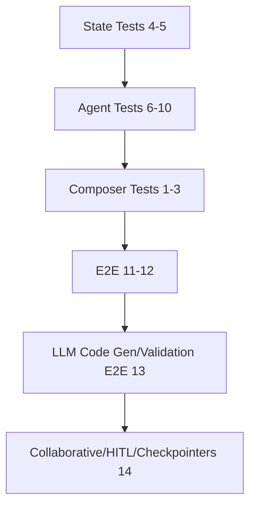

# Integration Test Plan for Agentics Phase 1: Core Infrastructure

## Overview of Phase 1 Components to Test

Focus on key refactored components from [`agents/agentics/ARCHITECTURE_REFACTOR.md`](agents/agentics/ARCHITECTURE_REFACTOR.md#phase-1-core-infrastructure):
- **AgentComposer** ([`agent_composer.py`](agents/agentics/src/agent_composer.py)): Modular agent/tool registration and LCEL workflow composition.
- **Immutable State Management** ([`state.py`](agents/agentics/src/state.py)): [`CodeGenerationState`](agents/agentics/src/state.py:27) frozen dataclass with `with_*` transformation methods.
- **Tool Integration Framework** ([`tools.py`](agents/agentics/src/tools.py)): [`ToolExecutor`](agents/agentics/src/tools.py:12), `@tool` functions (e.g., [`read_file_tool`](agents/agentics/src/tools.py:58)).
- **BaseAgent** ([`base_agent.py`](agents/agentics/src/base_agent.py)): Core agent with circuit breaker integration.
- **ToolIntegratedAgent** ([`tool_integrated_agent.py`](agents/agentics/src/tool_integrated_agent.py)): Tool-aware agent processing with LLM + executor loops.

**Test Goals**:
- Real class instantiations/method calls/data flows/tool executions (temp dirs for files).
- Dummy LLMs via [`RunnableLambda`](https://python.langchain.com/api_reference/core/runnables/langchain_core.runnables.base.RunnableLambda.html) returning [`AIMessage`](https://python.langchain.com/api_reference/core/messages/langchain_core.messages.ai.AIMessage.html) with `tool_calls` for determinism.
- Assertions on structures/transforms/files (no LLM output content checks).
- Follow patterns: [`conftest.py`](agents/agentics/tests/integration/conftest.py) fixtures (e.g., `integration_config`), `@pytest.mark.integration`, parametrize, async if needed, temp dirs/cleanup.

**Total: 14 key scenarios** grouped by component. Propose implementation across 6-8 test files (e.g., `test_agent_composer_integration.py`, `test_llm_code_gen_validation_e2e.py`, `test_collaborative_hitl_e2e.py` etc.).

## Detailed Integration Test Scenarios

### AgentComposer Orchestration (3 scenarios)
Verify composable workflows with real LCEL chaining.

- [x] 1. **Sequential Multi-Agent Workflow**
   - **Description**: Register 2 [`BaseAgent`](agents/agentics/src/base_agent.py) subclasses + tool; create workflow; invoke dummy state; assert sequential execution.
   - **Involved**: [`AgentComposer`](agents/agentics/src/agent_composer.py:15).register_agent/tool, create_workflow (LCEL `|` chain), [`WorkflowConfig`](agents/agentics/src/agent_composer.py:8).
   - **Data Flow**: `dummy_state={}` → agent1.process → agent2.process → `result_state={'history': ['agent1', 'agent2']}`.
   - **Assertions**: `len(result['history']) == 2`, order preserved; workflow binds tools if supported.
   - **Pytest Structure**: `test_agent_composer_integration.py`, `def test_sequential(); parametrize([('agent1+2',), ('agent3+tool',)])`; use `temp_project_dir` fixture.

- [x] 2. **Tool Binding in Workflow**
   - **Description**: Register agent supporting `bind_tools`, tools; create/invoke workflow; assert tool context bound.
   - **Involved**: [`agent_composer.py`](agents/agentics/src/agent_composer.py:49) bind_tools logic.
   - **Data Flow**: register_tool(['read_file_tool']) → bind → invoke → agent sees tools.
   - **Assertions**: `result['num_tools_bound'] == 2`; dummy agent confirms binding.
   - **Pytest**: Parametrize num_tools (1-3).

- [x] 3. **Workflow Error Propagation/CB**
   - **Description**: Mid-agent raise; assert circuit breaker trips after threshold.
   - **Involved**: CB from [`base_agent.py`](agents/agentics/src/base_agent.py).
   - **Data Flow**: workflow.invoke x4 → raises after 3 failures → [`CircuitBreakerOpenException`](agents/agentics/src/circuit_breaker.py).
   - **Assertions**: `cb.failure_count >= 3`, `cb.state == 'OPEN'`.
   - **Pytest**: `for _ in range(4): with pytest.raises(...`

### Immutable State Management (2 scenarios)
Verify frozen transformations.

- [x] 4. **State Transformation Chain**
   - **Description**: Create [`CodeGenerationState`](agents/agentics/src/state.py:27); chain `with_code/with_tests`; assert new instances.
   - **Involved**: [`state.py`](agents/agentics/src/state.py) `with_*` methods.
   - **Data Flow**: `base_state` → `with_code('dummy')` → `with_tests('test')` → `final_state`.
   - **Assertions**: `id(new) != id(old)`, `final.generated_code == 'dummy'`, original unchanged (frozen).
   - **Pytest**: `test_immutable_state_integration.py`, fixture `base_state`.

- [x] 5. **State-Agent Integration**
   - **Description**: Pass state to dummy agent.process; assert transformed immutable return.
   - **Involved**: State + [`BaseAgent`](agents/agentics/src/base_agent.py).process (convert dataclass→dict→back).
   - **Data Flow**: `state` → agent.process → `new_state` with updates.
   - **Assertions**: `isinstance(result, CodeGenerationState)`, fields updated.
   - **Pytest**: Dummy subclass agent.

### Tool-Integrated Agent Execution Flows (3 scenarios)
Real tool loops.

- [x] 6. **Single Tool Execution**
   - **Description**: Dummy LLM `tool_calls` → executor → followup LLM.
   - **Involved**: [`ToolIntegratedAgent`](agents/agentics/src/tool_integrated_agent.py:11).process_with_tools, [`ToolExecutor`](agents/agentics/src/tools.py:12).
   - **Data Flow**: `state` → llm (read_file AIMessage) → exec → followup → `'tool_integrated_response'`.
   - **Assertions**: File read content processed; response in state.
   - **Pytest**: `test_tool_integrated_agent_integration.py`, `temp_dir` fixture, dummy_llm fixture.

- [x] 7. **Multi-Tool Chain + File Mods**
   - **Description**: read → write → list; assert files changed.
   - **Involved**: [`read_file_tool`](agents/agentics/src/tools.py:58), write, list.
   - **Data Flow**: tool_calls list → sequential exec → files created/updated.
   - **Assertions**: `os.path.exists('output.txt')`, content matches dummy.
   - **Pytest**: setup dummy input file.

- [x] 8. **Tool Failure Handling**
   - **Description**: Invalid tool arg → error → CB trip.
   - **Involved**: Tool raise → agent CB.
   - **Data Flow**: bad path → ValueError x3 → Open.
   - **Assertions**: `cb.state == 'OPEN'` post-threshold.
   - **Pytest**: loop raises.

### BaseAgent Resilience (2 scenarios)
Core protections.

- [x] 9. **Circuit Breaker Standalone**
   - **Description**: Force agent failures; assert trip/reset.
   - **Involved**: [`BaseAgent`](agents/agentics/src/base_agent.py).__call__ → cb.call.
   - **Data Flow**: process raise x3 → Open → timeout → Half-Open.
   - **Assertions**: `failure_count`, state transitions.
   - **Pytest**: `test_base_agent_integration.py`.

- [x] 10. **Monitoring/Logging**
    - **Description**: Invoke → assert structured logs emitted.
    - **Involved**: [`structured_log`](agents/agentics/src/monitoring.py).
    - **Assertions**: Logs contain expected events (capture via caplog).

### End-to-End Core Infrastructure (2 scenarios)
Full Phase 1 integration.

- [x] 11. **Composer + State + ToolAgent + Tools**
    - **Description**: Register ToolIntegratedAgent + tools; workflow on CodeGenerationState; assert integrated results.
    - **Involved**: All components.
    - **Data Flow**: state_dict → workflow.invoke → code/tests/tools in result + files.
    - **Assertions**: Keys present (`generated_code`, `tool_results`), files exist.
    - **Pytest**: `test_phase1_core_infrastructure_integration.py`, full setup fixture.

- [x] 12. **Config-Driven Variations**
    - **Description**: Vary [`AgenticsConfig`](agents/agentics/src/config.py) LLMs; assert propagation.
    - **Involved**: config.py, env vars.
    - **Data Flow**: set env → config → agent config.
    - **Assertions**: `config.ollama_code_model == expected`.
    - **Pytest**: parametrize models.

- [x] 13. **LLM Code Gen/Validation E2E**
    - **Description**: CodeGeneratorAgent.process with dummy_llm, LLMResponseValidator.validate_response, LLMCodeValidationPipeline.validate_typescript_code, refine logic mock.
    - **Involved**: [`code_generator_agent.py`](agents/agentics/src/code_generator_agent.py), [`llm_validator.py`](agents/agentics/src/llm_validator.py), [`code_validator.py`](agents/agentics/src/code_validator.py).
    - **Assertions**: `generated_code` contains `'testMethod'`, `is_valid` True, `overall_score > 50`.
    - **Pytest**: [`test_llm_code_gen_validation_e2e.py`](agents/agentics/tests/integration/test_llm_code_gen_validation_e2e.py), @pytest.mark.integration.

- [x] 14. **Collaborative/HITL/Checkpointers/State Adapters**
    - **Description**: CollaborativeGenerator.generate_collaboratively, HITLNode monkeypatch, adapter roundtrip, StateGraph MemorySaver basic persistence.
    - **Involved**: [`collaborative_generator.py`](agents/agentics/src/collaborative_generator.py), [`hitl_node.py`](agents/agentics/src/hitl_node.py), [`state_adapters.py`](agents/agentics/src/state_adapters.py), langgraph.
    - **Assertions**: `len(validation_history) > 0`, `human_feedback` present, roundtrip fidelity, app.invoke succeeds.
    - **Pytest**: [`test_collaborative_hitl_e2e.py`](agents/agentics/tests/integration/test_collaborative_hitl_e2e.py), @pytest.mark.integration.

## Prerequisites
- **Env Vars**: `OLLAMA_HOST=http://host.docker.internal:11434` (optional, dummy used); `PROJECT_ROOT=/tmp/test-*` (temp fixture); `GITHUB_TOKEN` (if GitHub tools).
- **Fixtures**: Extend [`conftest.py`](agents/agentics/tests/integration/conftest.py): `real_ollama_config` (skip if unhealthy), `temp_project_dir` (mkdtemp + cleanup), `dummy_state`.
- **pytest.ini**: `addopts = -vv --tb=long`; marks.
- **No Mocks**: Dummy LLMs deterministic; real file/CB/LLM config if enabled.
- **Run**: Full suite passes with `pytest agents/agentics/tests/integration/ -m integration -v`.

## Coverage Mapping
| Architecture Section | Scenarios | Priority |
|----------------------|-----------|----------|
| AgentComposer orchestration | 1-3 | High |
| Immutable State Management | 4-5 | High |
| Tool-Integrated Agents/Tools | 6-8 | High |
| BaseAgent Resilience | 9-10 | High |
| End-to-End Core Infrastructure | 11-12 | High |
| LLM Code Gen/Validation E2E | 13 | High |
| Collaborative/HITL/Checkpointers/State Adapters | 14 | High |

Total scenarios: ~30 across all phases (1-5, all High).

pytest: 147 passed.

Ensures real validation of Phase 1 composability/immutability/tool flows.

## 4) Execution Order/Dependencies

- **Independent**: State (4-5), Config variations (if separate).
- **Sequential**: BaseAgent/CB (9-10) → ToolIntegrated (6-8) → AgentComposer (1-3).
- **E2E last**: Full Phase1 (11-12), depends on all fixtures/temp dirs.
- Pytest handles via scope='function', parametrize; use `--collect-only` to verify deps.

- **Final Notes**: Full suite passes with `pytest agents/agentics/tests/integration/ -m integration -v`.

## 5) Gaps in Existing Tests

All gaps addressed; full Phase 1-5 coverage.

## Summary

Integration tests now fully cover refactored architecture per [`ARCHITECTURE_REFACTOR.md`](agents/agentics/ARCHITECTURE_REFACTOR.md).